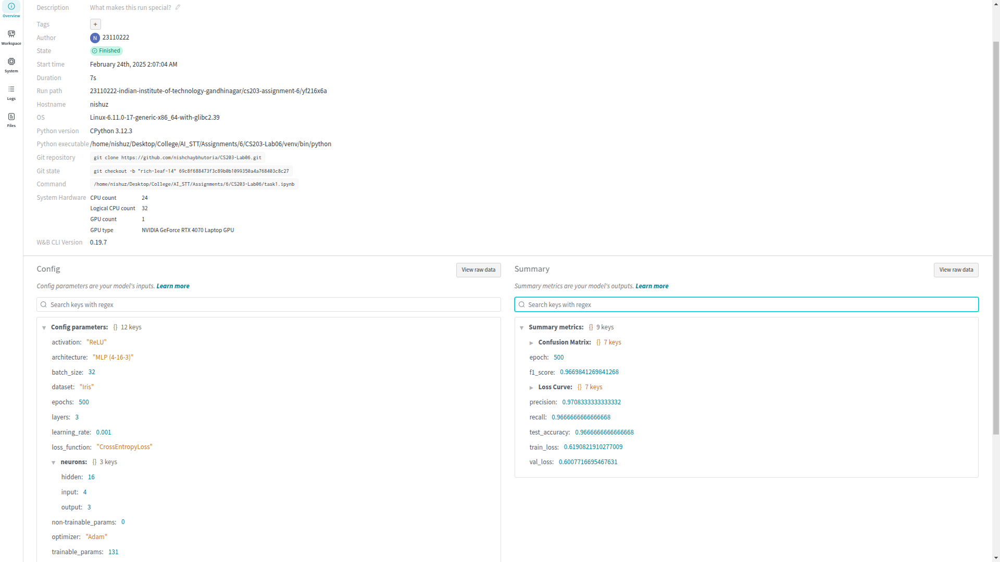
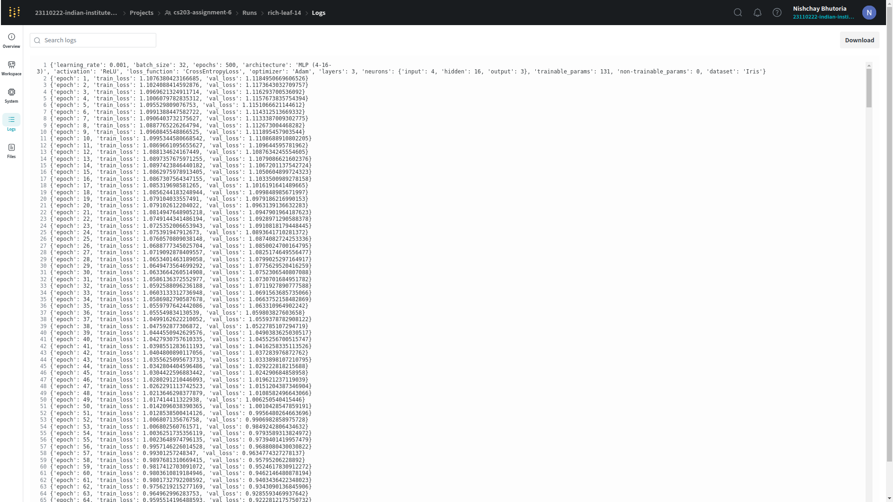
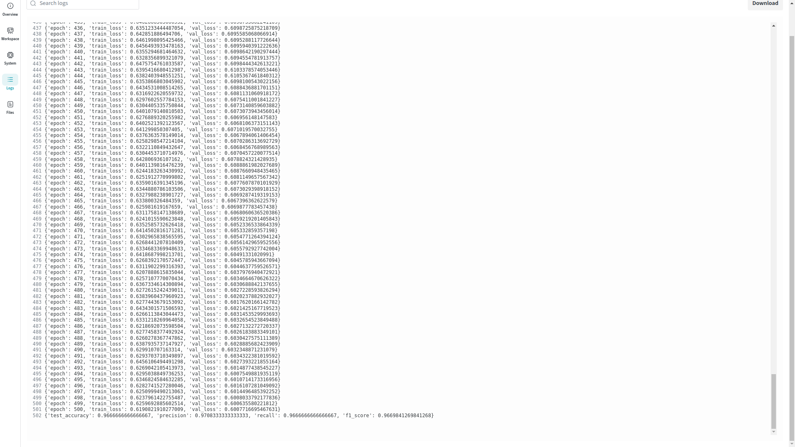
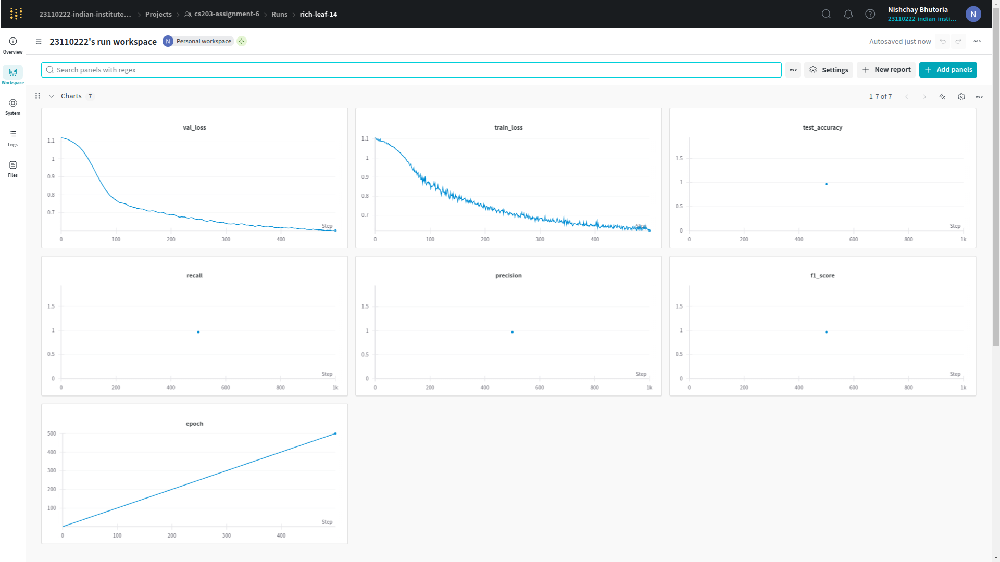
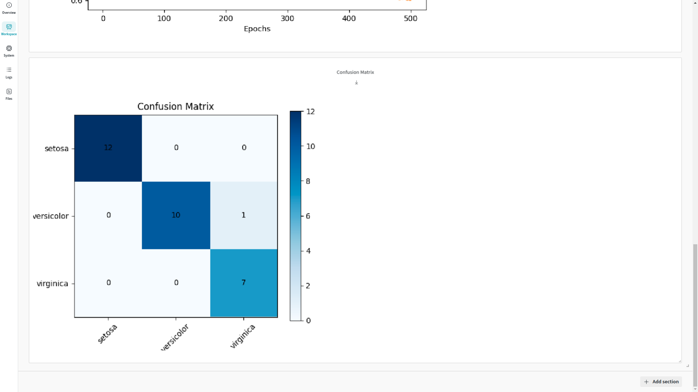
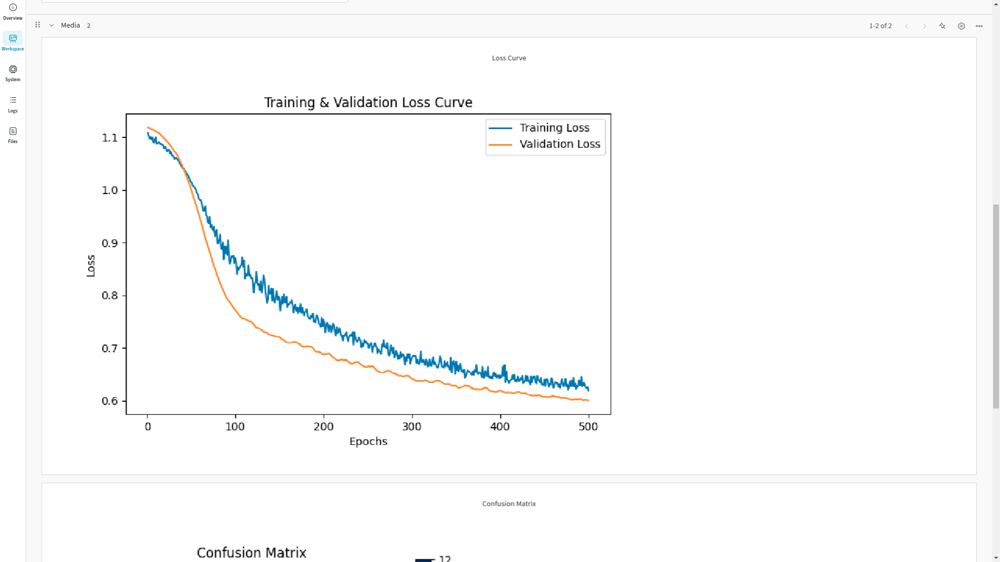

# **Lab 06: MLP Model Implementation & Experiment Tracking**  
**CS 203: Software Tools & Techniques for AI**  
**IIT Gandhinagar | Sem-II, 2024-25**  

---

## **Team Members**  
- **Nishchay Bhutoria** (23110222) 
- **Srivaths P** (23110321)

---

## **Objective**  
Implement a **Multi-Layer Perceptron (MLP)** model for **classification on the Iris dataset**, track experiments using **Weights & Biases (W&B)**, and evaluate model performance.

---

## **Task 1: MLP Model Implementation**  

### **Dataset Preparation**
- **Dataset**: Iris dataset from `sklearn.datasets.load_iris`
- **Preprocessing**:
  - Features normalized to `[0,1]` using **MinMaxScaler**.
  - Labels **one-hot encoded** using **OneHotEncoder**.
  - Splitting:
    - **Train Set**: `70%`
    - **Validation Set**: `10%`
    - **Test Set**: `20%`

### **Model Architecture**
- **Input Layer**: 4 neurons (one per feature)
- **Hidden Layer**: 16 neurons with **ReLU activation**
- **Output Layer**: 3 neurons (one per class) with **Softmax activation**

```txt
==========================================================================================
Layer (type:depth-idx)                   Output Shape              Param #
==========================================================================================
Sequential                               [32, 3]                   --
├─Linear: 1-1                            [32, 16]                  80
├─ReLU: 1-2                              [32, 16]                  --
├─Linear: 1-3                            [32, 3]                   51
├─Softmax: 1-4                           [32, 3]                   --
==========================================================================================
Total params: 131
Trainable params: 131
Non-trainable params: 0
Total mult-adds (Units.MEGABYTES): 0.00
==========================================================================================
Input size (MB): 0.00
Forward/backward pass size (MB): 0.00
Params size (MB): 0.00
Estimated Total Size (MB): 0.01
==========================================================================================
```

---

## **Task 2: Model Training**  
### **Model Setup**
- **Loss Function**: `CrossEntropyLoss`
- **Optimizer**: `Adam`
- **Learning Rate**: `0.001`
- **Batch Size**: `32`
- **Epochs**: `500`
- **Trainable Parameters**: `131`



### **Training Process**
- Trained using **PyTorch**, with **training and validation loss logged per epoch**.
- **Experiment tracking using W&B**.




---

## **Task 3: Experiment Tracking with Weights & Biases (W&B)**
### **W&B Dashboard Overview**
All training metrics are logged to W&B, including:

- Training and validation loss
- Final model evaluation
- Confusion matrix visualization

W&B  Experiment Dashboard:



Clearly, the last curve indicates that we trained our model for 500 epochs, at which point our training and validation losses begin to converge. Our final metrics match this decrease in loss: with our Accuracy being `0.9667` and our F1 Score being `0.9670`.


---

## **Task 4: Model Evaluation**  
### **Evaluation Metrics**
- **Accuracy**
- **Precision**
- **Recall**
- **F1-score**
- **Confusion Matrix Visualization**

| **Metric**  | **Value**  |
|-------------|------------|
| **Accuracy** | `96.67%` |
| **Precision** | `97.08%` |
| **Recall** | `96.67%` |
| **F1 Score** | `96.70%` |



### **Training & Validation Loss Curves**
The **training and validation loss per epoch** is plotted to analyze convergence.  

